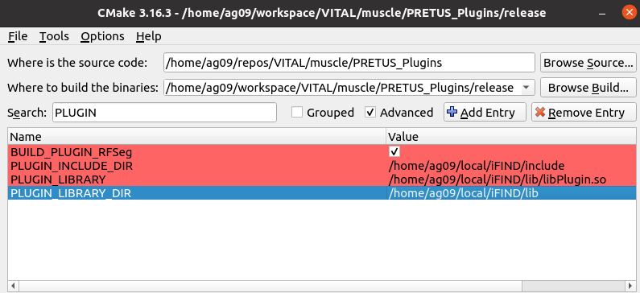
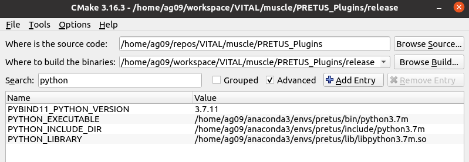

# Muscle segmentation 

Authors: 

Alberto Gomez (alberto.gomez@kcl.ac.uk)
Hamideh Kerdegari (hamideh.kerdegari@kcl.ac.uk)
Nhat Phung (nhat.phung@kcl.ac.uk)

# Summary

This plug-in does a segmentation of the RF muscle in ultrasound images. The model is implemented in Pytorch.


# Usage

After building the standalone software [PRETUS](https://github.com/gomezalberto/pretus), and after adding the path where this plug-in is installed in the pretus config file (`~/.config/iFIND/PRETUS.conf`), you should see the plug-in and it's help when running pretus:

```bash
...
(12) Plugin Name: 'RF Seg'

# PLUGIN RF Seg
   Automatic Rectus Femoris segmentation using Unet - impl. by Kerdegari et al.
	--rfseg_stream <val> [ type: STRING]	Name of the stream(s) that this plug-in takes as input. (Default: ) 
	--rfseg_layer <val> [ type: INT]	Number of the input layer to pass to the processing task. If negative, starts 
                                 		from te end. (Default: 0) 
	--rfseg_framerate <val> [ type: FLOAT]	Frame rate at which the plugin does the work. (Default: 20) 
	--rfseg_verbose <val> [ type: BOOL]	Whether to print debug information (1) or not (0). (Default: 0) 
	--rfseg_time <val> [ type: BOOL]	Whether to measure execution time (1) or not (0). (Default: 0) 
	--rfseg_showimage <val> [ type: INT]	Whether to display realtime image outputs in the central window (1) or not (0). 
                                     		(Default: <1 for input plugins, 0 for the rest>) 
	--rfseg_showwidget <val> [ type: INT]	Whether to display widget with plugin information (1-4) or not (0). Location is 
                                      		1- top left, 2- top right, 3-bottom left, 4-bottom right. (Default: visible, 
                                      		default location depends on widget.) 
   Plugin-specific arguments:
	--rfseg_modelname <*.h5> [ type: STRING]	Model file name (without folder). (Default: model_5l_AugPlus.pth) 
	--rfseg_cropbounds xmin:ymin:width:height [ type: STRING]	set of four colon-delimited numbers with the pixels to define the crop bounds 
                                                          		(Default: 0.25:0.2:0.55:0.65) 
	--rfseg_abscropbounds 0/1 [ type: BOOL]	whether the crop bounds are provided in relative values (0 - in %) or absolute 
                                        		(1 -in pixels) (Default: 0) 

```

To run the plug-in, you need to specify a video (or real time input). The results will be saved into the file specified by `--lusclassification_output`. An example call would be:

```bash
$ ./launcher_pretus.sh -pipeline "filemanager>rfseg>gui" --filemanager_input ~/data/VITAL/muscle/lumify/ --filemanager_extension png --filemanager_checkMhdConsistency 0 --filemanager_loop 1

```

Which produces a session similar to the one shown in the figure below:


# Build instructions

## Dependencies

The minimum requirements are:


* VTK. You need to fill in the VTK
* ITK (for video inputs, built with the `ITKVideoBridgeOpencv` option `ON`).  You need to fill in the VTK
* Boost
* Qt 5 (tested with 5.12). You need to fill in the `QT_DIR` variable in CMake
* c++11
* Python (you need the python libraries, include dirs)

Additionally, for this plug-in: 

* Python 3 (tested on Python 3.7) 
* Python 3 library
* [PyBind11](https://pybind11.readthedocs.io/en/stable/advanced/cast/overview.html) (for the python interface if required), with python 3.
* [matplotlib]()
* [numpy]()
* [opencv-python]()
* [scikit-learn]()
* [scipy]()
* [torch]() 1.14.0


The python include and binary should be the same used for pybind11. For example, if the python distribution comes from Anaconda, your `PYTHON_INCLUDE_DIR` in the CMake will be something like `<HOME_FOLDER>/anaconda3/include/python3.7m` and your `PYTHON_LIBRARY` will be something like `<HOME_FOLDER>/anaconda3/lib/libpython3.7m.so`.

## Build and install

Launch CMake configure and generate. You will need to fill in the following:

* QT:


* ITK/VTK:


* Plugin lib (from PRETUS):


* Python stuff (make sure this matches your conda environment for pretus):


* Also change your `CMAKE_INSTALL_PREFIX` to where you want to install the plug-in, typically `<HOME>/local/VITAL-muscle`.

Then make and install and launch.


